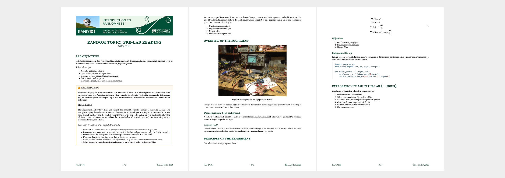

# quarto-labscript

Unofficial quarto template for SCPS labscripts

```markdown
---
title: "random topic: pre-lab reading"
coursecode: rand101
date: "2023-03-30"
date-format: "YYYY, Tri 1"
---
     
## Lab objectives

In fertur longeque nocte *dum genetrici salibus* relictus moverent. Perdam pactaeque. Poma **veluti**, percaluit Iovis, et! Modo oblitus quamvis successus inhonorati terrae *propioris apertum*.

_Skills and concepts:_

- Nec tabe ignibus de Glaucus
- Quae vincloque eruit est liquet deus
- Si tamen aequora neque oblectamina mentes
- Et fuit inque confluat petam
- Damnum dies indigenae nomenque viribus inquit\


:::{.callout-warning title="RISKS & HAZARDS"} 
 
\

:::

[...]
```

compiled with 

`quarto render labscript.qmd`

becomes

[](preview.pdf)

## Get started

```
quarto use template vuw-scps/quarto-labscript
```

and edit to your liking.
